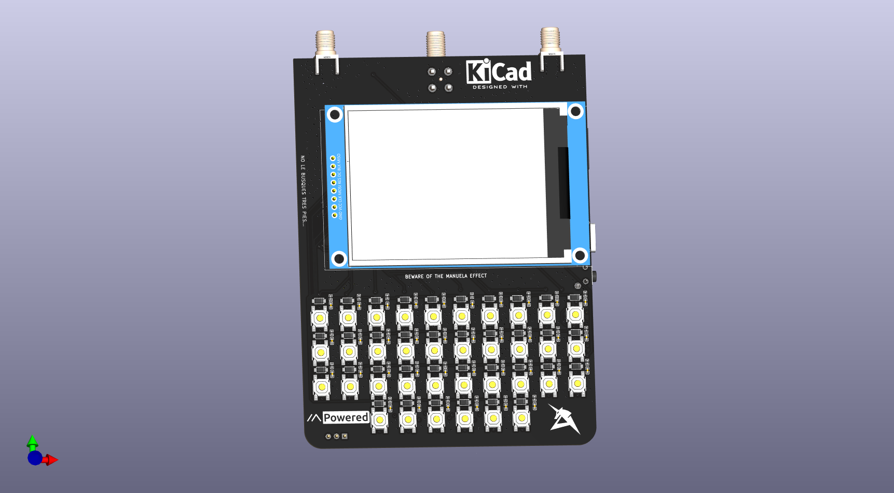
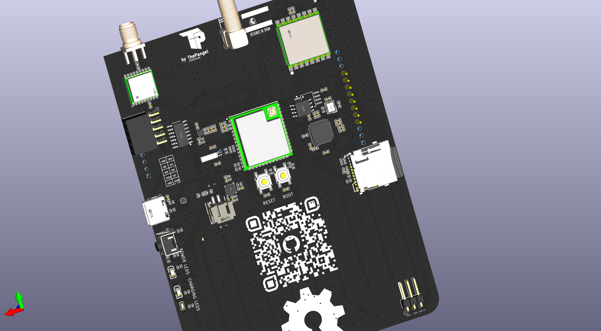

# MeshDeck

Standalone ESP32-S3 powered Meshtastic device!

---

Meshdeck is a Standalone Meshtastic device powered by an ESP32-S3, It has a built in keyboard and a touchscreen allowing you to communicate off grid without any phone, completely standalone.

I made this because I wanted to get into Meshtastic, and RF radio stuff, and the best way of learning is making

The keyboard is just a button matrix connected to an RP2040 which will act as an i2c slave and send keycodes to the esp. 

---

  

---

## Bill of Materials (BOM)

| Designator | Footprint                                | Quantity | Value           | LCSC Part #     |
|------------|------------------------------------------|----------|-----------------|-----------------|
| C1         | C0402                                    | 1        | 22uF            | C105226         |
| C10, C11, C12, C19 | C0402                            | 4        | 10uF            | C15525          |
| C13, C2, C20, C22, C23, C24, C25, C26, C27, C28, C30, C31, C32, C35, C36, C37, C38, C39, C4, C40, C41, C42, C43, C44, C45, C46, C47, C48, C49, C5, C50, C51, C52, C53, C54, C55, C56, C57, C58, C59, C60, C61, C62, C63, C64, C65, C66, C67, C68, C69, C70 | C0402 | 51 | 0.1uF | C1525 |
| C14, C15   | C0402                                    | 2        | 12pF            | C1547           |
| C16, C18, C21, C29, C3, C7 | C0402                   | 6        | 1uF             | C14445          |
| C17        | C0402                                    | 1        | 1Nf             | C1523           |
| C33, C34   | C0402                                    | 2        | 15pF            | C1548           |
| C6, C8, C9 | C0402                                    | 3        | 4.7 uF          | C23733          |
| CARD1      | TF-SMD_503398-1892                       | 1        | 503398-1892     | C428492         |
| CN1        | COMM-SMD_18P-L10.1-W9.7-P1.1-TL_L76-LB  | 1        | ATGM336H-6N-74  | C5804601        |
| D1         | SOT-666-6_L1.6-W1.2-P0.50-LS1.6-BR      | 1        | USBLC6-2P6      | C15999          |
| D10-D37    | SOD-123_L2.8-W1.8-LS3.7-RD              | 36       | 1N4148W T4      | C2099           |
| H1         | CONN-SMD_2P-P2.00_XUNPU_WAFER-PH2.0-2PWB| 1        | WAFER-PH2.0-2PWB| C3029440        |
| J1         | PinHeader_1x03_P2.54mm_Horizontal       | 1        | Conn_01x03_MountingPin | - |
| J2         | PinSocket_2x05_P2.54mm_Horizontal       | 1        | Conn_02x05_Odd_Even | - |
| L1         | L0402                                    | 1        | 0.47 µH         | C5788770        |
| L2         | L0402-RD                                 | 1        | 47nH            | C471397         |
| LED1, LED3 | LED0805-R-RD                             | 2        | 0805G (Green)   | C2297           |
| LED2       | LED0603-RD                               | 1        | Blue light 0603 | C2288           |
| LED4       | LED0402-RD                               | 1        | red             | C130719         |
| R1, R13, R17-R25 | R0402                              | 9        | 10KOhm          | C25531          |
| R10, R9    | R0402                                    | 2        | 1.8k            | C25871          |
| R11, R16   | R0402                                    | 2        | 10K             | C25744          |
| R12, R14, R15, R2-R4 | R0402                          | 6        | 0 Ohm           | C17168          |
| R19, R20   | R0402                                    | 2        | 220ohm          | C25091          |
| R26-R64    | R0402                                    | 37       | 1k              | C11702          |
| R5, R6     | R0402                                    | 2        | 5.1k            | C25905          |
| R62, R63   | R0603                                    | 2        | 100k            | C14675          |
| R7         | R0402                                    | 1        | 1.5K            | C25867          |
| R8         | R0402                                    | 1        | 1.5K            | C25867          |
| RF1, RF2   | SMA-SMD_HJ-SMA023                        | 2        | HJ-SMA023       | C1509219        |
| SW1-SW39   | SW-SMD_4P-L5.2-W5.2-P3.70-LS6.5         | 38       | 4*4*1.7         | C10852          |
| SW3        | KEY-TH_4P-L7.5-W6.8-P4.50-LS7.2         | 1        | SKHHLVA010      | C110289         |
| U1         | WIRELM-SMD_ESP32-S3-WROOM-1U            | 1        | ESP32-S3-WROOM-1U-N16R8 | C3013946 |
| U10        | CRYSTAL-SMD_4P-L3.2-W2.5-BL             | 1        | ABM8-272-T3_C20625731 | C20625731 |
| U2         | WIRELM-SMD_SX1278S165SY-T-X1            | 1        | SX1262S8S+T-X1  | C718838         |
| U3         | VSON-6_L1.5-W1.5-P0.50-TL               | 1        | TPS6282533DMQR  | C3189971        |
| U4         | QFN-16_L3.0-W3.0-P0.50-TL-EP1.7         | 1        | BQ24074RGTR     | C54313          |
| U5         | OSC-TH_BD2.0-P0.50                      | 1        | RN32768114      | C7206316        |
| U6         | 2.8 SPI LCD TFT ST7789                  | 1        | ~               | -               |
| U7         | SOIC-14_L8.7-W3.9-P1.27-LS6.0-BL        | 1        | CD4013BM        | C347580         |
| U8         | LQFN-56_L7.0-W7.0-P0.4-EP               | 1        | RP2040          | C2040           |
| U9         | SOIC-8_L5.3-W5.3-P1.27-LS8.0-BL         | 1        | W25Q128JVSIQTR  | C97521          |
| USBC1      | USB-C_SMD-TYPE-C-31-M-12_1              | 1        | TYPE-C-31-M-12  | C165948         |